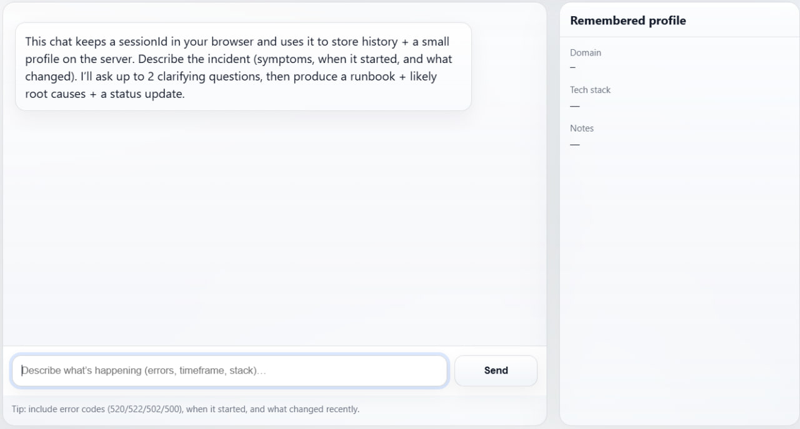

<p align="center">
  
</p>

# Pocket SRE (AI Incident Helper)

Pocket SRE is a small incident troubleshooting assistant built on Cloudflare. You describe a production issue in plain language and it responds with a short set of clarifying questions, then a runbook, likely root causes, and a status update you can paste into team chat.

This repository was created for the Cloudflare internship optional assignment. It includes an LLM (Workers AI), coordination and state (Durable Objects), user input (Pages), and memory that persists across refreshes.

## What it does

When you send an incident description, Pocket SRE first extracts structured details such as symptom, timeframe, and what changed recently. It asks up to two clarifying questions when it is missing information that affects the next steps. After that it produces a final response containing a prioritized runbook checklist, three likely root causes with a confidence hint, and a short status update message.

Each browser session gets a `sessionId` stored in `localStorage`. That id is sent with every request so the same Durable Object instance can keep conversation history, a small remembered profile, and a compact summary of older context.

## How it works

The `web/` folder is a static Cloudflare Pages site that sends chat messages to a Worker endpoint.

The `worker/` folder contains a Worker that routes each request to a Durable Object instance keyed by `sessionId`. The Durable Object is the coordinator. It loads stored state, decides whether to ask a clarifying question or produce the final runbook, calls Workers AI through `env.AI`, and writes updated state back to Durable Object storage.

State is kept intentionally small. Once the chat grows beyond roughly a dozen messages, older turns are summarized into a running `summary` string and only the most recent turns are kept as full messages.

## Stored state

The Durable Object persists the following per session:

`messages` as an array of chat turns

`profile` containing domain, tech stack, and notes

`lastIncidentSummary` as a compact snapshot of the most recent resolved incident

`summary` as a running conversation summary used to reduce token use on longer chats

## API

The Worker exposes one endpoint.

`POST /api/chat`

Request body:

```json
{ "sessionId": "string", "message": "string" }
```

Response body:

```json
{ "reply": "string", "profile": { "domain": "", "techStack": "", "notes": "" } }
```

## Local development

You need Node.js 18 or newer, plus a Cloudflare account with Workers, Durable Objects, and Workers AI enabled. Workers AI calls are made against your Cloudflare account even during local development.

Start the Worker first:

```bash
cd worker
npm install
npx wrangler login
npm run dev
```

Wrangler prints a local URL, typically `http://127.0.0.1:8787`. If Wrangler prompts you to register a `workers.dev` subdomain, complete that onboarding step in the Cloudflare dashboard and re-run `npm run dev`.

Then serve the static site from the `web/` folder using any static file server:

```bash
cd web
npx --yes http-server -p 8788 .
```

Open `http://localhost:8788` in your browser.

By default the frontend calls `http://localhost:8787/api/chat`. If your Worker dev URL is different, update the `WORKER_ORIGIN` constant inside `web/app.js`.

## Deploy

Deploy the Worker from the `worker/` folder:

```bash
cd worker
npm install
npm run deploy
```

Deploy the `web/` folder as a Cloudflare Pages project. It is static, so there is no build command. Set the output directory to `web`. After deploying, update the Worker URL in `web/app.js` so the Pages site points at your deployed Worker endpoint.

## Configuration

The project defaults to a Workers AI Llama model. Model ids can change over time, so the model can be made configurable. If your repo already supports it, set `LLM_MODEL` under `[vars]` in `worker/wrangler.toml`. If not, you can add it and read it in the Worker.

CORS is handled in the Worker so the Pages frontend can call the API endpoint.

For local development, you can authenticate either with `npx wrangler login` or by setting `CLOUDFLARE_API_TOKEN` in your shell before running `npm run dev`.

## Quick test prompts

Basic connectivity check:

```text
Hi, quick test. Reply with OK and a one sentence description of what you do.
```

Trigger the clarifying question flow:

```text
My site started returning 502 about 20 minutes ago. It is a Next.js app behind Cloudflare. I deployed right before it started and users report timeouts.
```

Provide enough detail to get the final runbook:

```text
Traffic is normal. 502s spike on /api/login. Origin is a Node server on a small VPS. Started right after deploy. No WAF changes.
```

Check memory:

```text
Remember this: domain = example.com. Stack = Next.js plus Node on VPS. Notes = deploys via GitHub Actions.
```

Refresh the page and ask what it saved.

## PROMPTS.md

AI-assisted coding was used during development. The prompts used to build and iterate on the project are recorded in `PROMPTS.md` 

LLMs used: ChatGPT 5.2 Thinking, Cursor Composer 1 + ChatGPT 5.2 for a few first prompts, Llama 3


